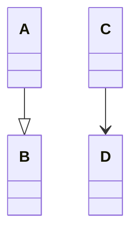

# Low-Level Design Notes

Author: [Prafull Saxena](https://www.linkedin.com/in/prafullsaxena)

## Basics

While drawing UML daigram for low-level design, we need to consider the following points:

1. **is-a relationship:** It is a relationship between two classes where one class is a type of another class. For example, a car is a type of vehicle. In this case, the car class is a subclass of the vehicle class. The car class inherits all the properties and methods of the vehicle class.
2. **has-a relationship:** It is a relationship between two classes where one class has a reference to another class. For example, a car has an engine. In this case, the car class has a reference to the engine class.

> Both relationships are denoted with different types of arrows in UML diagrams.

## Index

1. [SOLID Principles](./resources/solid.md)
   - **Single Responsibility Principle**: A class should have one, and only one, reason to change.
   - **Open/Closed Principle**: A class should be open for extension but closed for modification.
   - **Liskov Substitution Principle**: Subtypes must be substitutable for their base types without altering the correctness of the program.
   - **Interface Segregation Principle**: Clients should not be forced to depend on interfaces they do not use.
   - **Dependency Inversion Principle**: High-level modules should not depend on low-level modules. Both should depend on abstractions.
2. [Strategy Pattern](./resources/strategy-pattern.md)
   - **Definition**: Strategy Pattern defines a family of algorithms, encapsulates each algorithm, and makes the algorithms interchangeable within that family.
   - **Advantages**: It allows the client to choose the algorithm at runtime.

## About

This repository contains my notes on Low-Level Design (LLD) principles and patterns. The notes are written in Markdown format for easy readability and sharing.

I have made these notes from various sources like books, articles, and videos. below are some credtis to original authors:

- [Shrayansh jain | Low Level Design (LLD) from Basics to Advanced](https://www.udemy.com/course/lld-from-basics-to-advanced/?couponCode=LEARNNOWPLANS)
- [Refactoring Guru](https://refactoring.guru/)
- [GeeksforGeeks](https://www.geeksforgeeks.org/)

Feel free to explore and learn from these notes. Contributions and suggestions are welcome!

Please leve a ⭐ if you find this repository helpful.
