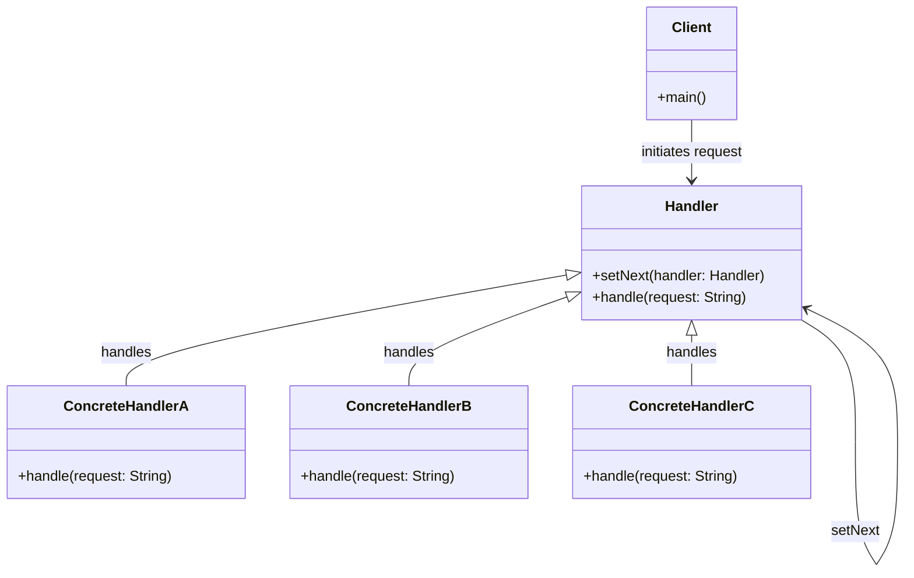

# Chain of Responsibility Design Pattern

[Back to README](../README.md)

## Overview
The Chain of Responsibility is a behavioral design pattern that allows an object to pass a request along a chain of potential handlers until one of them handles the request. This pattern decouples the sender of the request from its receivers, allowing for dynamic handling of requests.

## Components
1. **Handler**: Defines an interface for handling requests and maintaining a reference to the next handler.
2. **ConcreteHandler**: Implements the handling logic and forwards requests to the next handler in the chain.
3. **Client**: Initiates the request to the chain.

## UML Diagram


## Example
### Handler Interface
```java
interface Handler {
    void setNext(Handler handler);
    String handle(String request);
}
```

### Concrete Handlers
```java
class ConcreteHandlerA implements Handler {
    private Handler next;
    
    @Override
    public void setNext(Handler handler) {
        this.next = handler;
    }
    
    @Override
    public String handle(String request) {
        if (request.equals("A")) {
            return "Handled by ConcreteHandlerA";
        }
        return next != null ? next.handle(request) : null;
    }
}

class ConcreteHandlerB implements Handler {
    private Handler next;
    
    @Override
    public void setNext(Handler handler) {
        this.next = handler;
    }
    
    @Override
    public String handle(String request) {
        if (request.equals("B")) {
            return "Handled by ConcreteHandlerB";
        }
        return next != null ? next.handle(request) : null;
    }
}

class ConcreteHandlerC implements Handler {
    private Handler next;
    
    @Override
    public void setNext(Handler handler) {
        this.next = handler;
    }
    
    @Override
    public String handle(String request) {
        if (request.equals("C")) {
            return "Handled by ConcreteHandlerC";
        }
        return next != null ? next.handle(request) : null;
    }
}
```

### Client Code
```java
public class Client {
    public static void main(String[] args) {
        Handler handlerA = new ConcreteHandlerA();
        Handler handlerB = new ConcreteHandlerB();
        Handler handlerC = new ConcreteHandlerC();
        
        handlerA.setNext(handlerB);
        handlerB.setNext(handlerC);
        
        System.out.println(handlerA.handle("B"));  // Output: Handled by ConcreteHandlerB
        System.out.println(handlerA.handle("C"));  // Output: Handled by ConcreteHandlerC
        System.out.println(handlerA.handle("A"));  // Output: Handled by ConcreteHandlerA
    }
}
```