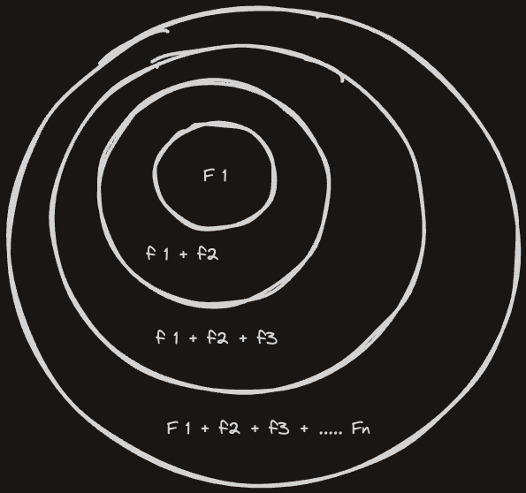
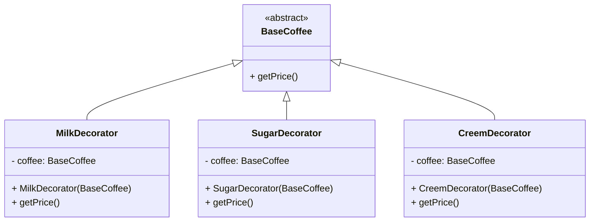

# Decorator Design Pattern

> **Definition**: Decorator Pattern attaches additional responsibilities to an object dynamically. It provides a flexible alternative to subclassing for extending functionality.

[Back to README](../README.md)

Decorator Pattern is a structural design pattern that allows adding new functionality to an object without altering its structure. It is a flexible alternative to subclassing for extending functionality. The pattern is useful when you need to add new behaviors to objects without affecting other objects of the same class.



We start witih one feature, and keep adding layers of features on top of it. Each layer is a decorator that adds a new feature to the object. The object can have multiple decorators, each adding a new feature to the object. The decorators can be added or removed at runtime.

## What problem does it solves?

Assume we want to keep increase the functionality of a class, an Ideal way of doing it is to create an interface and then keep implenting for each feature combination. But this approach is not scalable and will lead to class explosion.

Example: Assume we run a Coffee shop, and we created an Abstract class name Coffee with default price of 10, Now if a customer wants to add extra milk in the cofee we have to create another class named MilkWithCoffee and extends it with Coffee class, and then we have to create another class named MilkWithSugarWithCoffee and extends it with MilkWithCoffee class. This approach is not scalable and will lead to class explosion as there could be many combinations of features.

## How to sovle this?

To solve this problem, we can use Decorator Pattern.



```java

abstract class BaseCoffee {
    abstract int getPrice() {
        return 10; // default price of a coffee
    };
}

class MilkDecorator {
    private BaseCoffee coffee;

    MilkDecorator(BaseCoffee coffee) {
        this.coffee = coffee;
    }

    int getPrice() {
        return this.coffee.getPrice() + 2; // price of coffee + milk
    }
}

class SugarDecorator {
    private BaseCoffee coffee;

    SugarDecorator(BaseCoffee coffee) {
        this.coffee = coffee;
    }

    int getPrice() {
        return this.coffee.getPrice() + 1; // price of coffee + sugar
    }
}

class Main() {
    public static void main(String[] args) {
        BaseCoffee coffee = new BaseCoffee(); // 10
        coffee = new MilkDecorator(coffee); // 12
        coffee = new SugarDecorator(coffee); // 13
        System.out.println(coffee.getPrice()); // 13
    }
}


```

[Back to README](../README.md)
