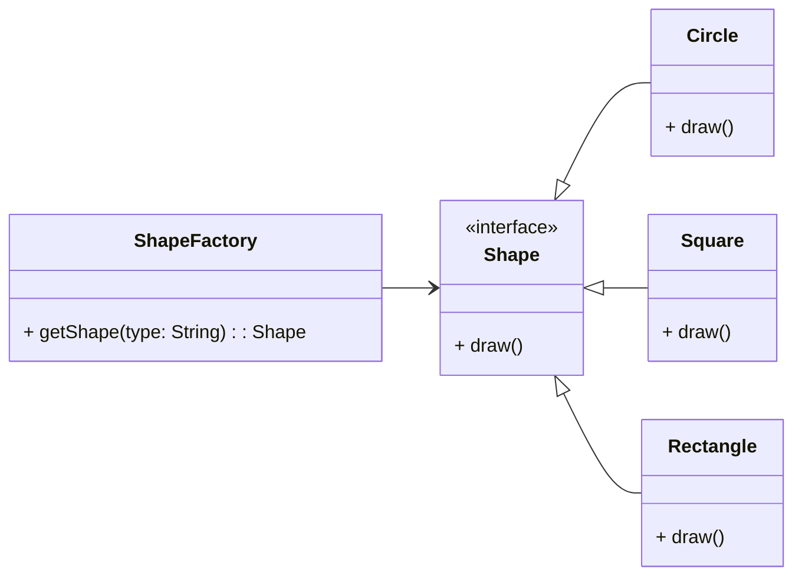
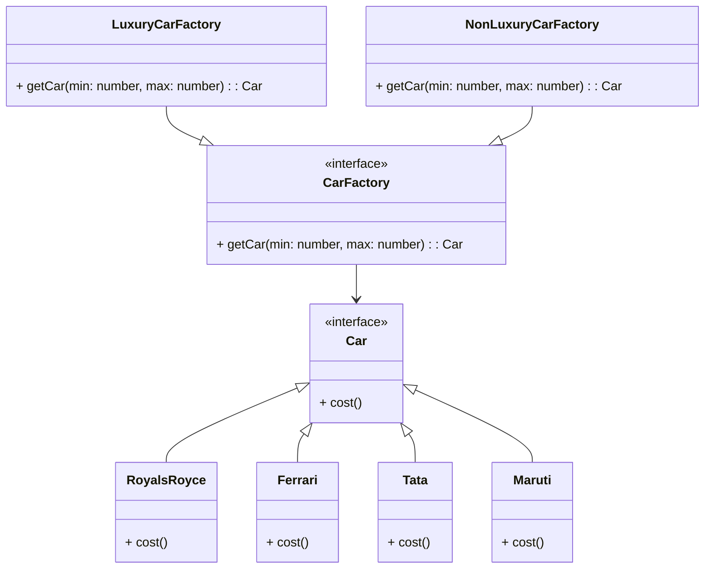

# Factory Design Pattern

> **Definition**: Factory Pattern defines an interface for creating an object, but lets subclasses decide which class to instantiate.

## [Back to README](../README.md)

We want to create an Object but with a different class based on some condition. We can use Factory Pattern to achieve this.

Assume we have a class Product and we want to create an object of Product based on some condition. We can create a Factory class that will create an object of Product based on the condition.



### Java Example

```java
interface Shape {
    void draw();
}

class Circle implements Shape {
    @Override
    public void draw() {
        System.out.println("Drawing Circle");
    }
}

class Square implements Shape {
    @Override
    public void draw() {
        System.out.println("Drawing Square");
    }
}

class Rectangle implements Shape {
    @Override
    public void draw() {
        System.out.println("Drawing Rectangle");
    }
}

class ShapeFactory {
    public Shape getShape(String type) {
        if (type == null) {
            return null;
        }
        if (type.equalsIgnoreCase("CIRCLE")) {
            return new Circle();
        } else if (type.equalsIgnoreCase("SQUARE")) {
            return new Square();
        } else if (type.equalsIgnoreCase("RECTANGLE")) {
            return new Rectangle();
        }
        return null;
    }
}

public class Main {
    public static void main(String[] args) {
        ShapeFactory shapeFactory = new ShapeFactory();

        Shape circle = shapeFactory.getShape("CIRCLE");
        circle.draw(); // Drawing Circle

        Shape square = shapeFactory.getShape("SQUARE");
        square.draw(); // Drawing Square

        Shape rectangle = shapeFactory.getShape("RECTANGLE");
        rectangle.draw(); // Drawing Rectangle
    }
}

```

## Abstract Factory Design Pattern

> **Definition**: Factory of Factory is called Abstract Factory Pattern. It provides an interface for creating families of related or dependent objects without specifying their concrete classes.



### Java Example

```java
interface Car {
    float cost();
}

class RoyalsRoyce implements Car {
    @Override
    public float cost() {
        return 1000000;
    }
}

class Ferrari implements Car {
    @Override
    public float cost() {
        return 500000;
    }
}

class Tata implements Car {
    @Override
    public float cost() {
        return 10000;
    }
}

class Maruti implements Car {
    @Override
    public float cost() {
        return 5000;
    }
}

interface CarFactory {
    Car getCar(int min, int max);
}

class LuxuryCarFactory implements CarFactory {
    @Override
    public Car getCar(int min, int max) {
        if (min >= 500000) {
            return new RoyalsRoyce();
        } else {
            return new Ferrari();
        }
    }
}

class NonLuxuryCarFactory implements CarFactory {
    @Override
    public Car getCar(int min, int max) {
        if (min >= 10000) {
            return new Tata();
        } else {
            return new Maruti();
        }
    }
}

public class Main {
    public static void main(String[] args) {
        CarFactory luxuryCarFactory = new LuxuryCarFactory();
        Car luxuryCar = luxuryCarFactory.getCar(500000, 1000000);
        System.out.println("Luxury Car Cost: " + luxuryCar.cost());

        CarFactory nonLuxuryCarFactory = new NonLuxuryCarFactory();
        Car nonLuxuryCar = nonLuxuryCarFactory.getCar(10000, 500000);
        System.out.println("Non-Luxury Car Cost: " + nonLuxuryCar.cost());
    }
}

```

### Factory vs Abstract Factory Design Pattern

- **Factory Pattern**: Factory Pattern defines an interface for creating an object, but lets subclasses decide which class to instantiate. It promotes loose coupling between the client and the object creation.
- **Abstract Factory Pattern**: Abstract Factory Pattern provides an interface for creating families of related or dependent objects without specifying their concrete classes. It allows creating objects without specifying the exact class to create.

### When to use Factory Design Pattern

- When a class can't anticipate the class of objects it must create.
- When a class wants its subclasses to specify the objects it creates.
- When a class wants to delegate the responsibility of object creation to one of several helper subclasses.

### Advantages of Factory Design Pattern

- It promotes loose coupling between the client and the object creation.
- It allows creating objects without specifying the exact class to create.
- It allows adding new classes without modifying the existing code.

---

[Back to README](../README.md)
