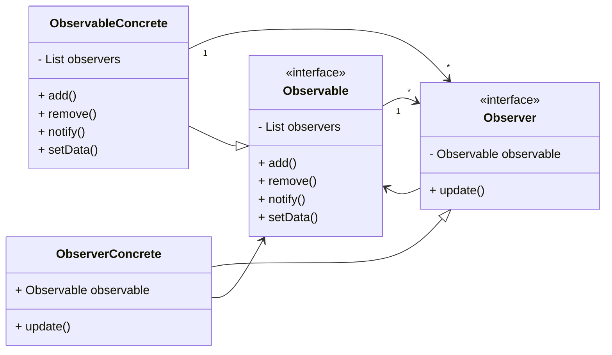

# Observer Design Pattern

> **Definition**: Observer Pattern defines a one-to-many dependency between objects so that when one object changes state, all its dependents are notified and updated automatically.

[Back to README](../README.md)

In Observer Pattern, We have a observable class which has a list of observers. When the state of observable class changes, it notifies all the observers.



```java
interface ObservableInterface {

    List<ObserverInterface> observers;
    add(); // allow an observer to subscribe/register
    remove(); // allow an observer to unsubscribe
    notify(); // notify all observers
    setData();
    getData();
}

class ObservableConcrete implements ObservableInterface {

    List<ObserverInterface> observers;

    int data;

    public void add(Observer observer) {
        this.observers.add(observer);
    }

    public void remove(Observer observer) {
        this.observers.remove(observer);
    }

    notify() {
        for (Observer observer : observers) {
            observer.update();
        }
    }
    setData(int data) {
        // set the data
        if (this.data != data) {
            this.data = data;
            notify();
        }
    }
    getData() {
        return this.data;
    }
}

interface Observer {

    update(); // update the observer
}

class ObserverConcrete implements Observer {

    ObservableInterface observable;

    public ObserverConcrete(ObservableConcrete observable) {
        this.observable = observable;
    }

    public void update() {
        System.out.println("Data updated: " + observable.getData());
    }
}
```

---

[Back to README](../README.md)
