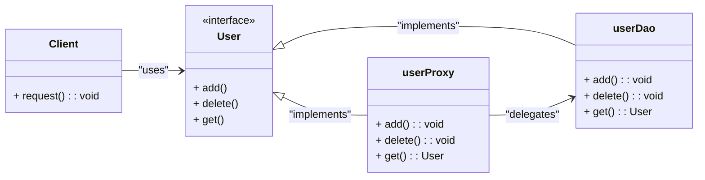

# Proxy Design Pattern

**Definition**: Proxy Pattern acts as a intercepter in between core operation, that can be used as preprocessor and postprocessor. 

## [Back to README](../README.md)

The Proxy Pattern is particularly useful in scenarios where you want to add a layer of control over the access and operations performed on an object, enhancing security and performance without altering the original implementation.

## What problem does it solves?

The Proxy Pattern solves the problem of controlling access to an object, allowing for additional functionalities such as lazy loading, access control, and logging without modifying the original object's code. 


## How to sovle this?

To implement the Proxy Pattern, create a proxy class that implements the same interface as the real object. The proxy class will hold a reference to the real object and delegate calls to it, while also adding any additional functionality needed, such as access control or logging.




### Java Example

```java

interface User {
    void add();
    void delete();
    User get();
    String role();
}

class userDao implements User {
    String role; 

    public void add() {
        System.out.println("User added");
    }

    public void delete() {
        System.out.println("User deleted");
    }

    public User get() {
        return this;
    }

    public String role() {
        return this.role;
    }
}

class userProxy implements User {
    private userDao realUser;

    public userProxy() {
        this.realUser = new userDao();
    }

    public void add() {
        // checking context
        if (realUser.getrole().equals("ADMIN")) {
            realUser.add();
        }
    }

    public void delete() {
        // checking context
        if (realUser.getrole().equals("ADMIN")) {
            realUser.delete();
        }
    }

    public User get() {
        // checking context
        if (realUser.getrole().equals("ADMIN") || realUser.getrole().equals("USER")) {
            return realUser.get();        
        }
    }
}

```

[Back to README](../README.md)