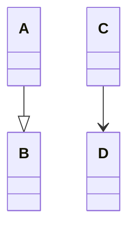
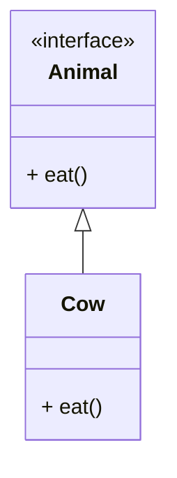
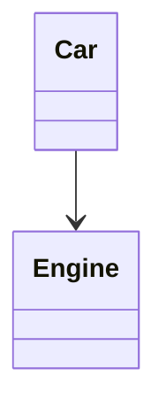

# Relations in UML

While drawing UML daigram for low-level design, we need to consider the following points:

1. **is-a relationship:** [A and B is having **IS-A Relationship**] It is a relationship between two classes where one class is a type of another class. For example, a car is a type of vehicle. In this case, the car class is a subclass of the vehicle class. The car class inherits all the properties and methods of the vehicle class.
2. **has-a relationship:** [C and D is having **HAS-A Relationship**] It is a relationship between two classes where one class has a reference to another class. For example, a car has an engine. In this case, the car class has a reference to the engine class.

> Both relationships are denoted with different types of arrows in UML diagrams.



## IS-A Relationship

In the IS-A relationship, the child class is a type of the parent class. It is also known as a generalization relationship. The child class inherits all the properties and methods of the parent class.



```java

interface Animal {
    void eat();
}

class Cow extends Animal {
    void eat() {
        System.out.println("Cow is eating");
    }
}
```

## HAS-A Relationship

In the HAS-A relationship, one class has a reference to another class. It is also known as an aggregation relationship. The class that has a reference to another class is known as the owner class, and the class that is referenced is known as the member class.



```java
class Car {
    private Engine engine;
}
```
