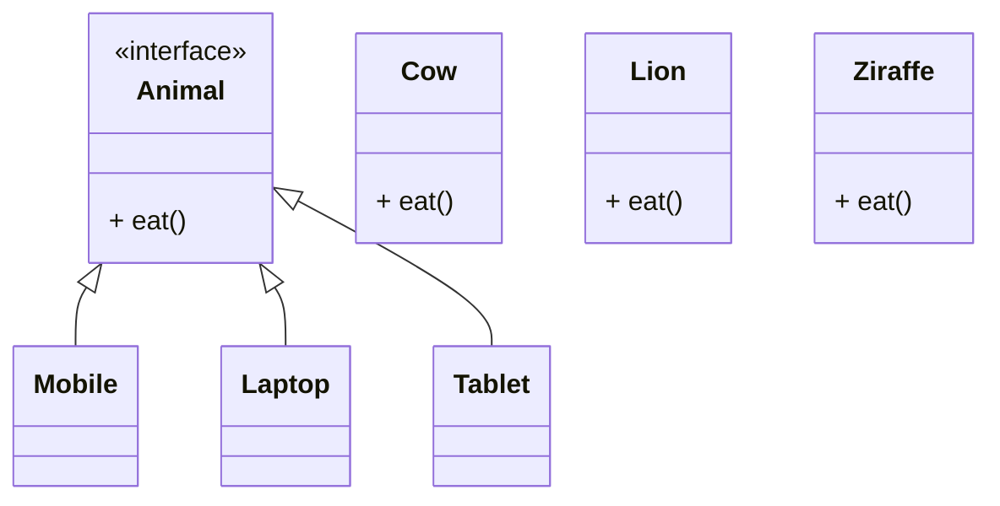

# Stratigy Design Pattern

> **Definition**: Strategy Pattern defines a family of algorithms, encapsulates each algorithm, and makes the algorithms interchangeable within that family.

[Back to README](../README.md)

### Daigram

Here in the above daigram,
