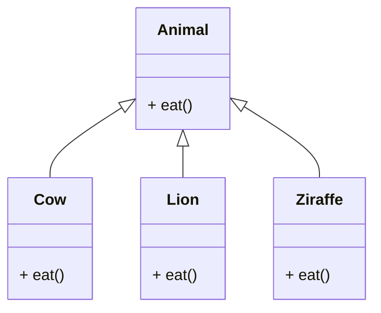
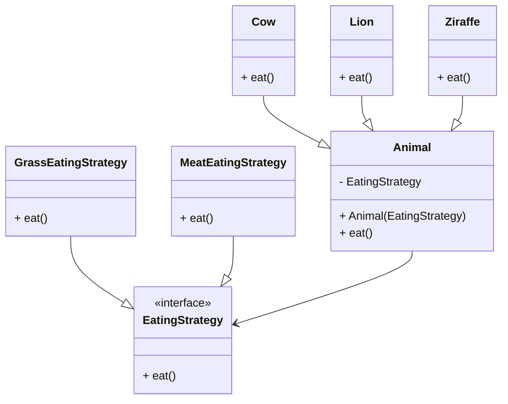

# Stratigy Design Pattern

> **Definition**: Strategy Pattern defines a family of algorithms, encapsulates each algorithm, and makes the algorithms interchangeable within that family.

[Back to README](../README.md)



```java
class Animal {
    void eat();
}

class Cow extends Animal {
    void eat() {
        System.out.println("Eating Grass");
    }
}

class Lion extends Animal {
    void eat() {
        System.out.println("Eating Meat");
    }
}

class Ziraffe extends Animal {
    void eat() {
        System.out.println("Eating Grass");
    }
}

```

---

Here in the above daigram, we have an interface `Animal` which has a method `eat()`. We have three classes `Cow`, `Lion`, and `Ziraffe` which implements the `Animal` interface and overrides the `eat()` method.

Animals can eat two differents types of food, i.e. `Grass` and `Meat`. So, we can have two different strategies for `eat()` method.

hence Cow and Ziraffe eats grass whereas Lion eats meat, hence Cow and Ziraffe has same eating stratiegy however both has to write the same code for eating grass. So, we can use the strategy pattern here to avoid code duplication.



```java

interface EatingStrategy {
    void eat();
}

class GrassEatingStrategy implements EatingStrategy {
    void eat() {
        System.out.println("Eating Grass");
    }
}

class MeatEatingStrategy implements EatingStrategy {
    void eat() {
        System.out.println("Eating Meat");
    }
}

class Animal {
    private EatingStrategy eatingStrategy;

    Animal(EatingStrategy eatingStrategy) {
        this.eatingStrategy = eatingStrategy;
    }

    void eat() {
        eatingStrategy.eat();
    }
}

class Cow extends Animal {
    Cow() {
        super(new GrassEatingStrategy());
    }
}

class Lion extends Animal {
    Lion() {
        super(new MeatEatingStrategy());
    }
}

class Ziraffe extends Animal {
    Ziraffe() {
        super(new GrassEatingStrategy());
    }
}
```

---

[Back to README](../README.md)
