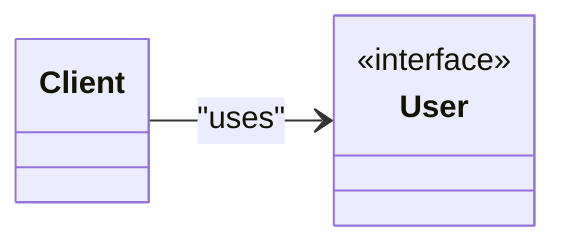

# Design Pattern Name

> **Definition**: beiefe intro

## [Back to README](../README.md)

> detailed definition

## What problem does it solves?

> write what problem it solves


## How to sovle this?


> write how it solves to problem




### Java Example

```java

// code here

```

[Back to README](../README.md)